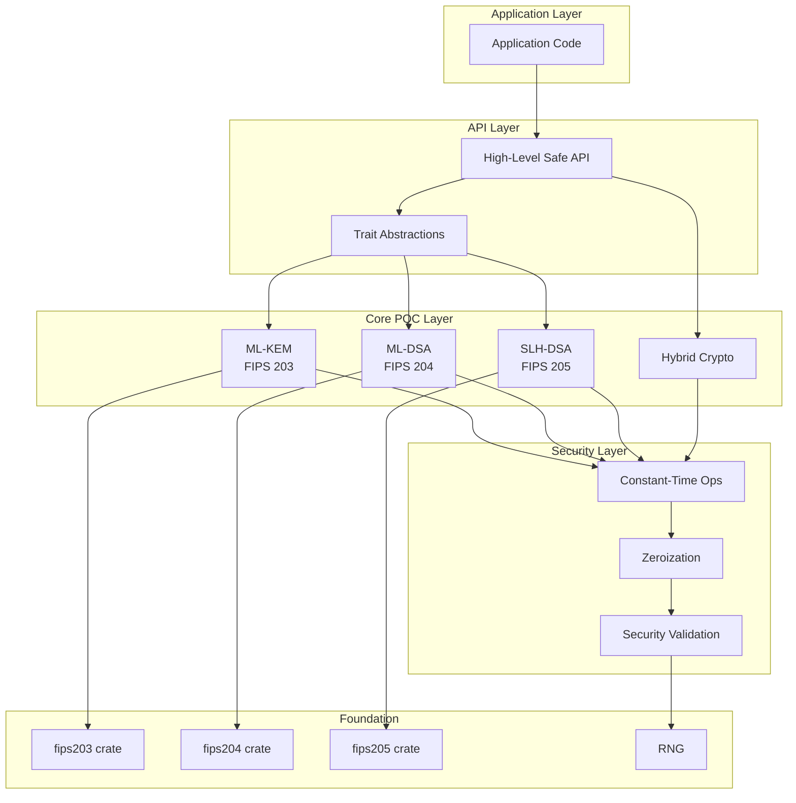
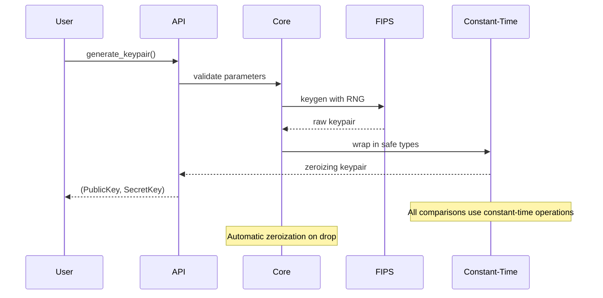
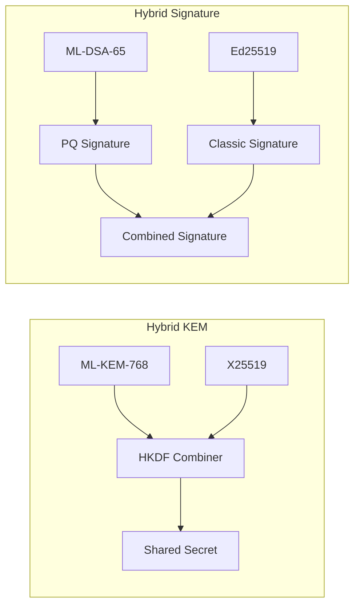
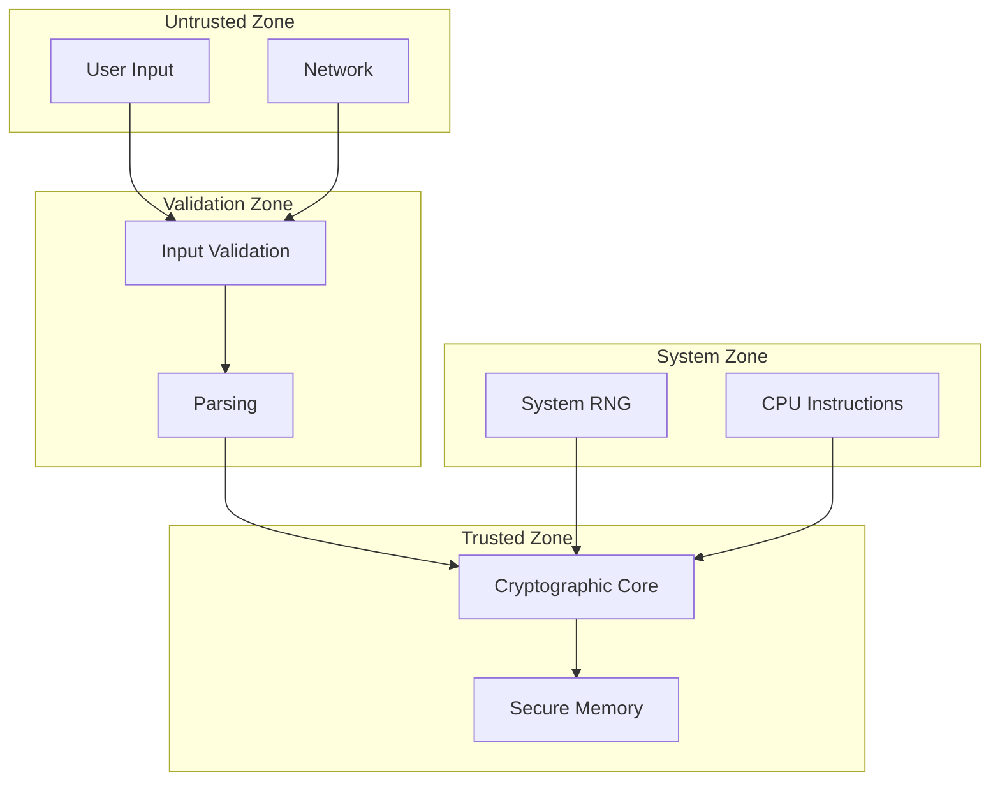
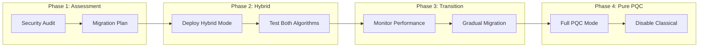

# Saorsa PQC - Architecture Documentation

## Table of Contents
1. [System Overview](#system-overview)
2. [Design Philosophy](#design-philosophy)
3. [Module Architecture](#module-architecture)
4. [Security Architecture](#security-architecture)
5. [Cryptographic Primitives](#cryptographic-primitives)
6. [Trust Boundaries](#trust-boundaries)
7. [Performance Characteristics](#performance-characteristics)
8. [Integration Guidelines](#integration-guidelines)

## System Overview

Saorsa PQC is a production-ready post-quantum cryptography library implementing NIST-standardized algorithms with a focus on security, performance, and ease of integration. The library provides both pure post-quantum and hybrid cryptographic modes for defense-in-depth.



## Design Philosophy

### Core Principles

1. **Security First**: All operations prioritize security over performance
2. **Zero Trust**: Never trust input data; validate everything
3. **Defense in Depth**: Multiple layers of security controls
4. **Fail Secure**: Errors result in secure states, never expose secrets
5. **Minimal Surface**: Expose only necessary functionality
6. **Memory Safety**: Leverage Rust's ownership system for safety

### Design Decisions

- **No `unsafe` in API layer**: All unsafe operations isolated in FIPS implementations
- **Mandatory zeroization**: All sensitive data cleared on drop
- **Constant-time operations**: Timing attack resistance for all comparisons
- **Implicit rejection**: KEM decapsulation always succeeds (with random output on failure)
- **Type safety**: Strong typing prevents algorithm confusion

## Module Architecture

### Layer Structure

```
src/
├── api/              # High-level safe API
│   ├── mod.rs       # Public exports
│   ├── kem.rs       # ML-KEM interface
│   ├── sig.rs       # ML-DSA interface
│   ├── slh.rs       # SLH-DSA interface
│   ├── traits.rs    # Common traits
│   └── errors.rs    # Error types
│
├── pqc/              # Core implementations
│   ├── ml_kem.rs    # ML-KEM-768
│   ├── ml_kem_512.rs
│   ├── ml_kem_1024.rs
│   ├── ml_dsa.rs    # ML-DSA-65
│   ├── ml_dsa_44.rs
│   ├── ml_dsa_87.rs
│   ├── hybrid.rs    # Hybrid modes
│   ├── constant_time.rs
│   └── types.rs     # Core types
│
└── lib.rs           # Library root
```

### Module Interactions



## Security Architecture

### Defense Layers

1. **Input Validation**
   - Size checks on all inputs
   - Range validation for parameters
   - Entropy quality verification

2. **Cryptographic Security**
   - NIST-approved algorithms only
   - Proper randomness (getrandom)
   - Domain separation for signatures
   - Hedged randomness where applicable

3. **Implementation Security**
   - Constant-time operations
   - No branching on secrets
   - Zeroization of sensitive data
   - Protected memory patterns

4. **API Security**
   - Type-safe interfaces
   - Impossible invalid states
   - Forced error handling (Result types)
   - No raw pointer exposure

### Threat Model

| Threat | Mitigation |
|--------|------------|
| Timing Attacks | Constant-time operations via `subtle` crate |
| Memory Disclosure | Automatic zeroization with `zeroize` |
| Algorithm Confusion | Strong typing, separate types per algorithm |
| Weak Randomness | System RNG via `getrandom` |
| Buffer Overflow | Rust's memory safety, bounds checking |
| Side Channels | Constant-time, no secret-dependent branches |
| Quantum Attacks | NIST PQC algorithms, hybrid modes available |

## Cryptographic Primitives

### Post-Quantum Algorithms

#### ML-KEM (Module-Lattice KEM)
- **Standard**: FIPS 203
- **Security Levels**: 
  - ML-KEM-512 (NIST Level 1, ~128-bit)
  - ML-KEM-768 (NIST Level 3, ~192-bit)
  - ML-KEM-1024 (NIST Level 5, ~256-bit)
- **Use Case**: Key encapsulation for secure key exchange
- **Properties**: IND-CCA2 secure, implicit rejection

#### ML-DSA (Module-Lattice Digital Signature)
- **Standard**: FIPS 204
- **Security Levels**:
  - ML-DSA-44 (NIST Level 2)
  - ML-DSA-65 (NIST Level 3)
  - ML-DSA-87 (NIST Level 5)
- **Use Case**: Digital signatures
- **Properties**: EUF-CMA secure, hedged signing

#### SLH-DSA (Stateless Hash-Based Digital Signature)
- **Standard**: FIPS 205
- **Variants**:
  - SHA2/SHAKE, 128/192/256-bit security
  - Small (s) vs Fast (f) variants
- **Use Case**: Long-term signatures, hash-based security
- **Properties**: Quantum-resistant even against future attacks

### Classical Algorithms (Hybrid Mode)

- **X25519**: ECDH key exchange
- **Ed25519**: EdDSA signatures
- **ChaCha20-Poly1305**: AEAD encryption
- **SHA3/BLAKE3**: Hashing
- **HKDF**: Key derivation

### Hybrid Cryptography



## Trust Boundaries

### External Boundaries
- User input (always untrusted)
- Network data (always untrusted)
- File system (partially trusted)
- System RNG (trusted)

### Internal Boundaries
- API layer → Core layer (validated)
- Core layer → FIPS layer (trusted)
- Memory management (Rust-enforced)

### Security Zones



## Performance Characteristics

### Algorithm Performance (Relative)

| Operation | ML-KEM-768 | ML-DSA-65 | SLH-DSA-SHA2-128s | Classical |
|-----------|------------|-----------|-------------------|-----------|
| KeyGen | ~1ms | ~2ms | ~10ms | ~0.01ms |
| Encap/Sign | ~1ms | ~5ms | ~100ms | ~0.1ms |
| Decap/Verify | ~1ms | ~2ms | ~5ms | ~0.1ms |
| Public Key | 1184 B | 1952 B | 32 B | 32 B |
| Secret Key | 2400 B | 4032 B | 64 B | 32 B |
| Ciphertext/Sig | 1088 B | 3309 B | 7856 B | 64 B |

### Optimization Strategies

1. **Memory Pooling**: Pre-allocated buffers for hot paths
2. **Parallel Operations**: Optional parallel processing
3. **SIMD**: Hardware acceleration where available
4. **Batch Operations**: Amortize setup costs
5. **Lazy Initialization**: Defer expensive operations

### Performance Monitoring

```rust
// Example performance measurement
let start = Instant::now();
let (pk, sk) = ml_kem.generate_keypair()?;
let keygen_time = start.elapsed();

// Target: < 10ms for all operations except SLH-DSA signing
assert!(keygen_time < Duration::from_millis(10));
```

## Integration Guidelines

### Basic Integration

```rust
use saorsa_pqc::{MlKem, MlDsa, SlhDsa};

// Simple KEM usage
let kem = MlKem::ml_kem_768();
let (public_key, secret_key) = kem.generate_keypair()?;
let (ciphertext, shared_secret) = kem.encapsulate(&public_key)?;

// Simple signature usage
let dsa = MlDsa::ml_dsa_65();
let (public_key, secret_key) = dsa.generate_keypair()?;
let signature = dsa.sign(&secret_key, message, None)?;
```

### Advanced Integration

```rust
use saorsa_pqc::{PqcConfig, HybridKem, SecurityValidator};

// Configure for specific requirements
let config = PqcConfig::builder()
    .mode(PqcMode::Hybrid)
    .ml_kem_variant(MlKemVariant::MlKem768)
    .validation_level(ValidationLevel::Strict)
    .build()?;

// Use with validation
let validator = SecurityValidator::new();
validator.validate_config(&config)?;

// Hybrid mode for transition period
let hybrid = HybridKem::new();
let (pk, sk) = hybrid.generate_keypair()?;
```

### Security Checklist

- [ ] Use latest version of the library
- [ ] Enable all security features in Cargo.toml
- [ ] Validate all inputs before processing
- [ ] Handle all Result types explicitly
- [ ] Never log or serialize secret keys
- [ ] Use secure channels for key distribution
- [ ] Implement key rotation policies
- [ ] Monitor for security advisories
- [ ] Test with fuzzing and sanitizers
- [ ] Review constant-time properties

### Migration Path



## Appendix: Security Properties

### ML-KEM Security
- **IND-CCA2**: Indistinguishability under adaptive chosen ciphertext attack
- **Implicit Rejection**: Failed decapsulation returns random secret
- **Forward Secrecy**: Past sessions secure even if long-term keys compromised

### ML-DSA Security
- **EUF-CMA**: Existentially unforgeable under chosen message attack
- **Hedged Signing**: Randomness mixed with message for resilience
- **Context Binding**: Domain separation prevents cross-protocol attacks

### SLH-DSA Security
- **Hash-Based**: Security relies only on hash function properties
- **Stateless**: No state management required
- **Future-Proof**: Resistant to quantum attacks on structured problems

## References

- [NIST PQC Standardization](https://csrc.nist.gov/projects/post-quantum-cryptography)
- [FIPS 203: ML-KEM Standard](https://csrc.nist.gov/pubs/fips/203/final)
- [FIPS 204: ML-DSA Standard](https://csrc.nist.gov/pubs/fips/204/final)
- [FIPS 205: SLH-DSA Standard](https://csrc.nist.gov/pubs/fips/205/final)
- [Rust Crypto Guidelines](https://github.com/RustCrypto)
- [Constant-Time Cryptography](https://bearssl.org/constanttime.html)